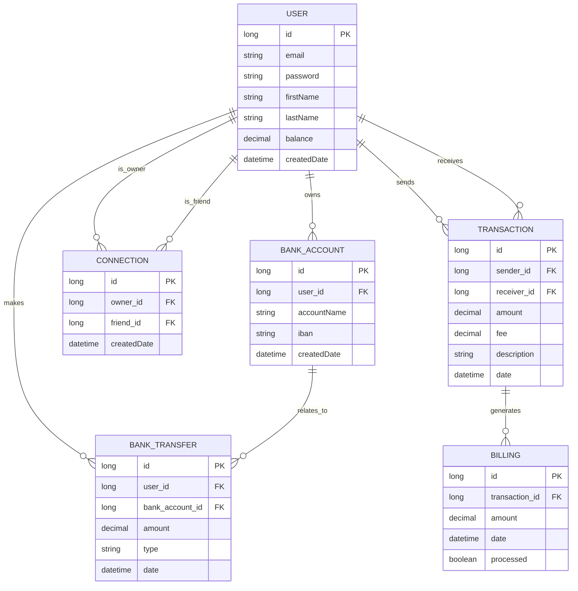

# PayMyBuddy
## Physical Data Model

The physical data model below represents the database structure used by the PayMyBuddy application.

### Table Descriptions

- **USER**: Stores information about users registered on the platform.
- **BANK_ACCOUNT**: Contains information about bank accounts linked to users.
- **CONNECTION**: Represents relationships between users (friends/contacts).
- **TRANSACTION**: Records all transactions made between users.
- **BANK_TRANSFER**: Tracks money transfers between users' bank accounts and the application.
- **BILLING**: Manages billing related to transactions made on the platform.

### Main Relationships

- A user can have multiple bank accounts
- A user can have multiple connections with other users
- A user can send/receive multiple transactions
- A user can make multiple bank transfers
- Each bank transfer is linked to a specific bank account
- Each transaction can generate one or more billings
